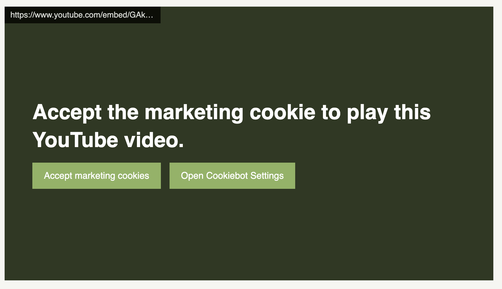

# CookiebotEmbeds (`cookiebot-embeds`)


`cookiebot-embeds` is a JavaScript library designed to manage marketing cookie consents in web applications, particularly for embedded content such as YouTube videos and other iframe embeds. It ensures compliance with GDPR and similar data protection regulations by dynamically updating embedded content based on the user's cookie consent status. Trusted and used by [Aviicii.com](https://avicii.com/) [AbbaTheMuseum](https://abbathemuseum.com) [RFSU](https://www.rfsu.com/), [Nordic Welfare](http://nordicwelfare.org/), and many more sites in EU. 

## Features

- **Dynamic Consent Management**: Automatically updates the content of embedded marketing materials such as YouTube videos or other iframes based on the user's cookie consent. This ensures compliance while maintaining a seamless user experience.

- **Customizable User Interface**: Offers extensive customization options for consent messages, buttons, and overall styles. This allows the library to be seamlessly integrated into any website design, maintaining brand consistency.

- **Event-Driven Updates**: The library is highly responsive to browser and Cookiebot events, ensuring that user consent preferences are respected in real time throughout the browsing session.

- **Ease of Integration**: Designed for easy integration with existing web applications, `CookiebotEmbeds` requires minimal setup and configuration, making it accessible to developers of varying skill levels.

- **Responsive and Adaptive Design**: Fully compatible with a wide range of devices and screen sizes, ensuring that consent management is effective and user-friendly on any device.

- **GDPR and Data Protection Compliance**: By managing marketing cookies and embedded content consents, the library helps in complying with GDPR and other data protection regulations, crucial for businesses operating in or targeting customers in the European Union.

- **Enhanced User Experience**: Focuses on providing a non-intrusive yet clear consent management process, improving overall user experience while navigating through embedded content and cookie consent dialogs.

## Quick Usage Guide
Effortlessly add Cookiebot Embeds to your website by copying the script below right after the main Cookiebot code. This ensures privacy compliance by dynamically managing consent for iframe embeds and other content blocked by Cookiebot's autoblock feature, aligning with GDPR and privacy regulations quickly and efficiently.
```html
<script type="module" data-cookieconsent="ignore">
    import CookiebotEmbeds from 'https://cdn.jsdelivr.net/npm/cookiebot-embeds@latest/dist/cookiebot-embeds.es.js';
    new CookiebotEmbeds();
</script>
```

## Getting Started

### Prerequisites

- Cookiebot account and script setup on your website.
- Basic understanding of JavaScript and web development.

### Installation

Begin by installing the `cookiebot-embeds` package in your project. Use either of the following commands based on your package manager:
- For npm: `npm install cookiebot-embeds`
- For yarn: `yarn add cookiebot-embeds`

Next, create a new instance of CookiebotEmbeds. You can provide an optional custom configuration object as your requirement. For example:
```javascript
import CookiebotEmbeds from 'cookiebot-embeds';

const embeds = new CookiebotEmbeds({
    // Custom configuration options
});
```

## Configuration

The library accepts a configuration object with the following options:

- `showSourceURL`: (boolean) Determines if the source URL should be shown. Default: true.
- `headingText`: (object) Text for various headings based on content type.
    - `default`: (string) Default heading text.
    - `youtube`: (string) YouTube-specific heading text with URL origin that contains "youtube" (this targets youtube.com, youtube-nocookie.com).
- `cookieCategoriesTitle`: (object) Text for various cookie categories.
    - `preferences`: (string) Text for the preferences cookie category.
    - `statistics`: (string) Text for the statistics cookie category.
    - `marketing`: (string) Text for the marketing cookie category.
- `acceptButtonText`: (string) Text for the accept cookies button.
- `openCookiebotSettingsButtonText`: (string) Text for the button to open Cookiebot settings.
- `background`: (string) Background color of the iframe message overlay.
- `textColor`: (string) Text color of the message.
- `buttonBackgroundColor`: (string) Background color of the button.
- `buttonBackgroundColorHover`: (string) Hover background color of the button.
- `buttonTextColor`: (string) Text color of the button.
- `gap`: (string) Gap between elements in the overlay.
- `customCSS`: (string) Custom CSS to further style the overlay and its components.

### Example Configurations
Here is an example of how you might configure the library:
```javascript
const embeds = new CookiebotEmbeds({
    showSourceURL: true,
    headingText: {
        default: "To access this content, please enable [REQUIRED_COOKIES] cookies.",
        youtube: "To play this video, please enable marketing cookies required by YouTube."
    },
    cookieCategoriesTitle: {
        preferences: "Preferences",
        statistics: "Statistics",
        marketing: "Marketing"
    },
    acceptButtonText: "Accept marketing cookies",
    openCookiebotSettingsButtonText: "Open Cookiebot Settings",
    background: "rgba(0, 0, 0, 0.7)",
    textColor: "white",
    buttonBackgroundColor: "#88b364",
    buttonBackgroundColorHover: "#6e9e4f",
    gap: "15px",
    customCSS: `
        body {
            margin: 20px;
        }
    `
});
```

## Default Configuration Values

`cookiebot-embeds` is pre-configured with default values to ensure ease of use right out of the box. These values are designed to cover common use cases and can be overridden by passing a custom configuration object. The text `[REQUIRED_COOKIES]` string lists down the dynamic cookies that user needs to be accept to view the dynamic embed.

Here are the default values for each configuration option: 

- `showSourceURL`: `true`
  - By default, the source URL of the embed is shown. This can be helpful for transparency and trust.

- `headingText`: 
  - `default`: "Enable [REQUIRED_COOKIES] cookies on Cookiebot settings to view this content."
  - `youtube`: "To play this video, please enable marketing cookies required by YouTube."
  - These texts are displayed as headings on the consent overlay, depending on the content source origin string.

- `cookieCategoriesTitle`: 
  - `preferences`: "Preferences"
  - `statistics`: "Statistics"
  - `marketing`: "Marketing"
  - Text for various cookie categories.

- `acceptButtonText`: "Accept required cookies"
  - The default text for the button to accept marketing cookies.

- `openCookiebotSettingsButtonText`: "Open Cookiebot Settings"
  - The default text for the button that opens Cookiebot settings.

- `background`: "rgba(0, 0, 0, 0.7)"
  - The default background color for the overlay is a semi-transparent black.

- `textColor`: "white"
  - The default text color is white, providing contrast against the dark background.

- `buttonBackgroundColor`: "#88b364"
  - The default background color for buttons is a shade of green.

- `buttonBackgroundColorHover`: "#6e9e4f"
  - On hover, the button background changes to a slightly darker green.

- `buttonTextColor`: "white"
  - The text color for buttons is white for readability.

- `gap`: "15px"
  - The default gap between elements in the overlay is 15 pixels.

- `customCSS`: ""
  - By default, no additional custom CSS is applied. This can be used to further customize the appearance.

### Overriding Default Values

To override these defaults, pass a custom configuration object when creating an instance of `CookiebotEmbeds`. For example:
```javascript
const embeds = new CookiebotEmbeds({
    showSourceURL: false, // Hides the source URL
    // ... other custom configurations
});
```
