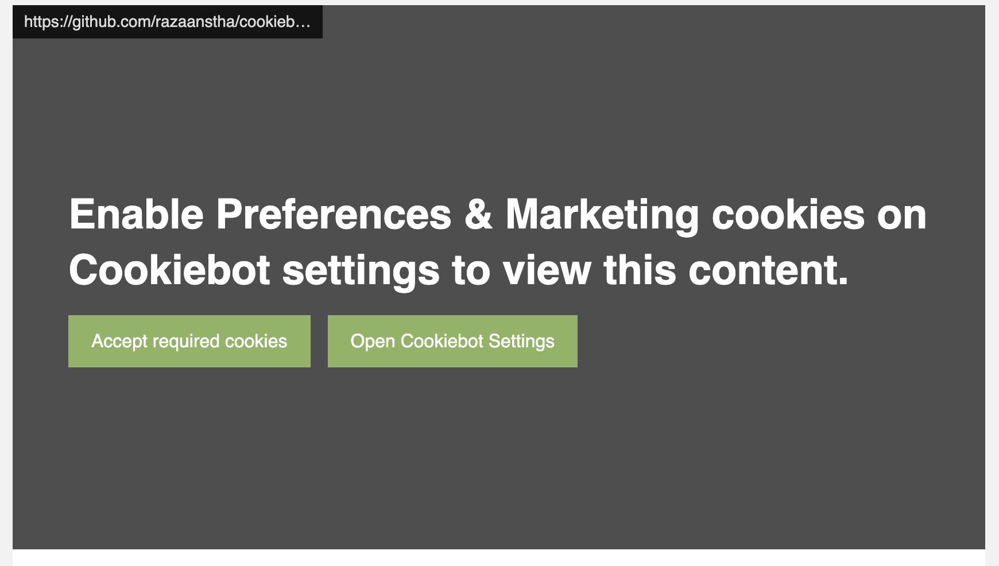

# CookiebotEmbeds

Inform your users that they have not accepted the required cookies correcly to run the Youtube and embeds from other services which you sites depends upon. It supports YouTube and for other iframe emebeds it just shows accept the cookies to view this source.

 CookiebotEmbeds is a JavaScript library designed to manage marketing cookie consents in web applications, particularly for embedded content such as YouTube videos. It ensures compliance with GDPR and similar data protection regulations by dynamically updating embedded content based on the user's cookie consent status.

## Features

- **Dynamic Consent Management**: Automatically updates embedded marketing content (like iframes) based on user's cookie consent. 
- **Customizable UI**: Offers various customization options for messages, buttons, and styles to align with the website's aesthetics.
- **Event-Driven Updates**: Reacts to browser events to ensure consent preferences are respected throughout the browsing session.
- **Ease of Integration**: Easy to integrate with existing web applications with minimal configuration required.
- **Responsive Design**: Compatible with various devices and screen sizes.

## Getting Started

### Prerequisites

- Cookiebot account and script setup on your website.
- Basic understanding of JavaScript and web development.

### Installation

Add the `CookiebotEmbeds.js` script to your project. 

```
import CookiebotEmbeds from 'CookiebotEmbeds';

const embeds = new CookiebotEmbeds({
    // Custom configuration options
});
```

## Configuration

The library accepts a configuration object with the following options:

- `showSourceURL`: (boolean) Show the source URL of the embed. Default: true.
- `headingText`: (object) Custom heading texts for different sources.
- `buttonText`: (string) Text for the consent button.
- `openCookiebotButtonText`: (string) Text for the button to open Cookiebot settings.
- `backgroundColor`: (string) Background color of the message overlay.
- `textColor`: (string) Text color of the message.
- `buttonBackgroundColor`: (string) Background color of the button.
- `buttonTextColor`: (string) Text color of the button.
- `gap`: (string) Gap between elements in the overlay.
- `customCSS`: (string) Custom CSS to further style the overlay and its components.

### Example Configurations
Here is an example of how you might configure the library:
```javascript
const embeds = new CookiebotEmbeds({
    showSourceURL: true,
    headingText: {
        default: "To access this content, please enable marketing cookies.",
        // For adding custom message just simply type the domain hostname without the 
        // subdomain and extension and simply add like this for e.g www.youtube.com --> youtube
        youtube: "To play this video, please enable marketing cookies required by YouTube."
    },
    buttonText: "Accept marketing cookies",
    openCookiebotButtonText: "Open Cookiebot Settings",
    background: "rgba(0, 0, 0, 0.7)",
    textColor: "white",
    buttonBackgroundColor: "#88b364",
    buttonBackgroundColorHover: "#6e9e4f",

    buttonTextColor: "white",
    gap: "12px",
    customCSS: ""
});
```

This configuration object allows users to customize the appearance and behavior of the library according to their specific needs and website design.

This section of the README explains the configuration options available in the `CookiebotEmbeds` library, providing users with the information they need to tailor the library to their specific requirements.
